# Установка менеджера паролей в Windows Server 2016

**1. Изменение имени сервера, установка IIS 10, открытие порта 5353.**

Нажмите “Win+X”, затем “Y” и измените стандартное имя сервера. 
Измение имя на “passwork” для того, чтобы задействовать локальный домен “passwork.local” в частной сети.

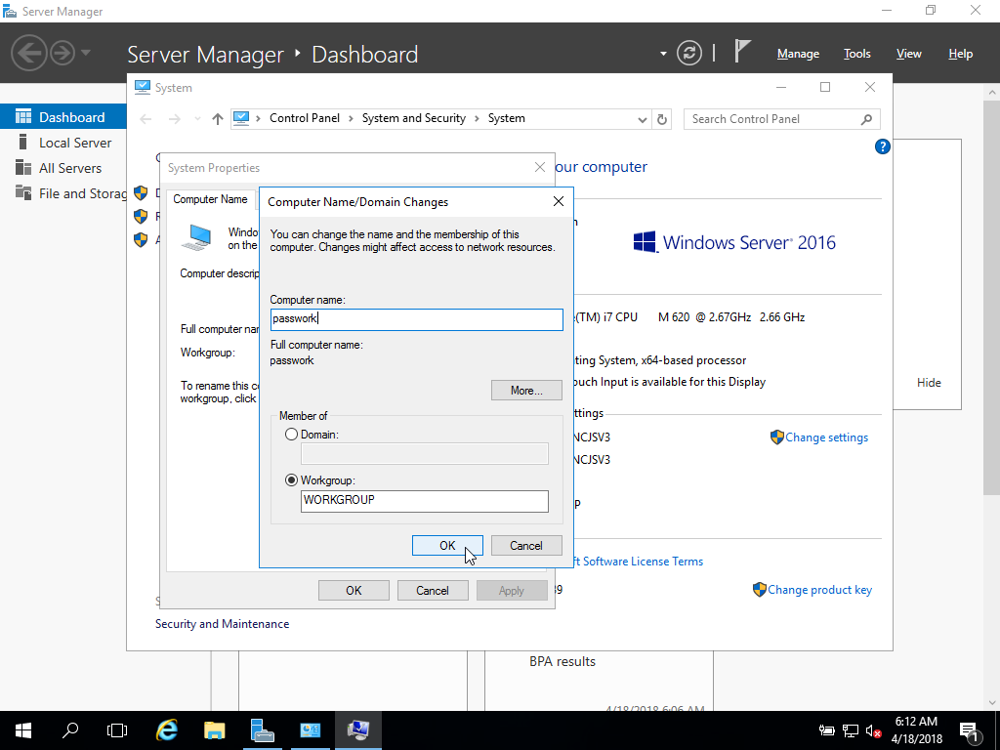

Для того, чтобы внесенные изменения вступили в силу необходимо перезагрузить систему.


Откройте “Server Manager” и добавьте роль “Web Server (IIS)”.


В настройках файервола разрешите входящее соединение по протоколу UDP на порт 5353.


**2. Установка MongoDB.**

Откройте ссылку [https://www.mongodb.com/download-center](https://www.mongodb.com/download-center) выберите “Community Server”, “Windows”, нажмите “Download”, затем “Save”. Начнется процесс скачивания пакета MongoDB. Нажмите “Run” чтобы начать процесс установки.

Примечание: измените параметры безопасности IE перед загрузкой. Разрешите "Active Scripting" и "Download" функции в настройках браузера.

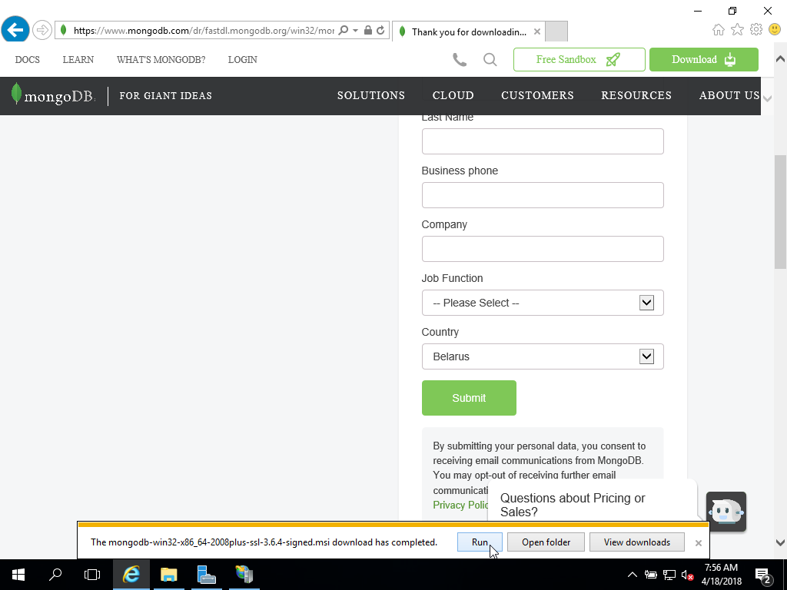

Нажмите “Next”, согласитесь с условиями использования, опять нажмите “Next”. Выберите опцию “Complete”.

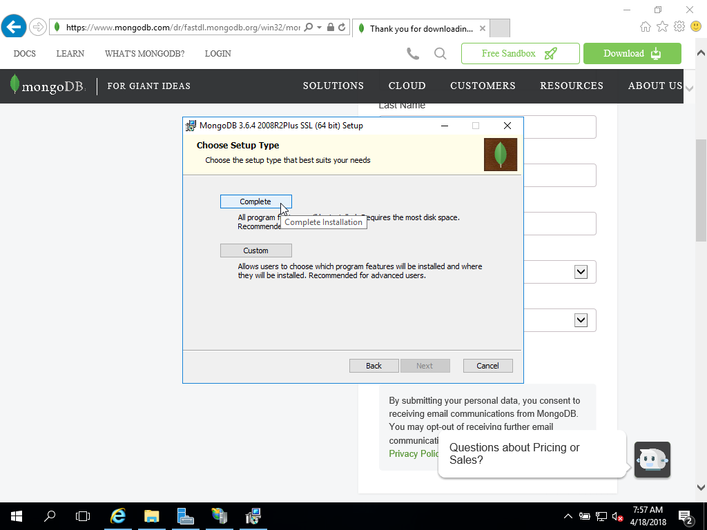

Отмените установку “Install MongoDB Compass”. Нажмите “Next”, затем “Install” для начала процесса установки.

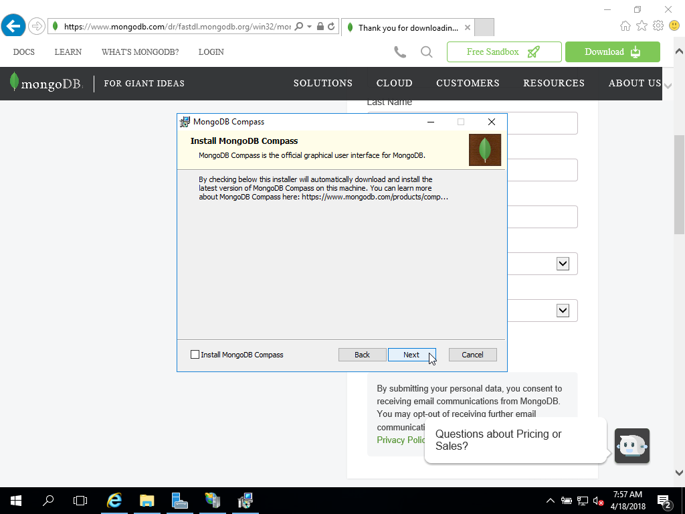

Нажмите “Finish” после завершения процесса установки.


**Настройка файервола Windows.**

Откройте “Control Panel” и выберите раздел “System and Security”. Затем нажмите на “Windows Firewall”.

Вы должны увидеть окно управления файерволом Windows:


Нажмите на “Allow an app or feature trough Windows Firewall”, появится новое окно. Нажмите “Allow another app.” -> нажмите “Browse” и найдите приложение MongoDB Database Server "C:\Program Files\MongoDB\Server\3.6\bin\mongod.exe", затем нажмите "Add" и "Ok".

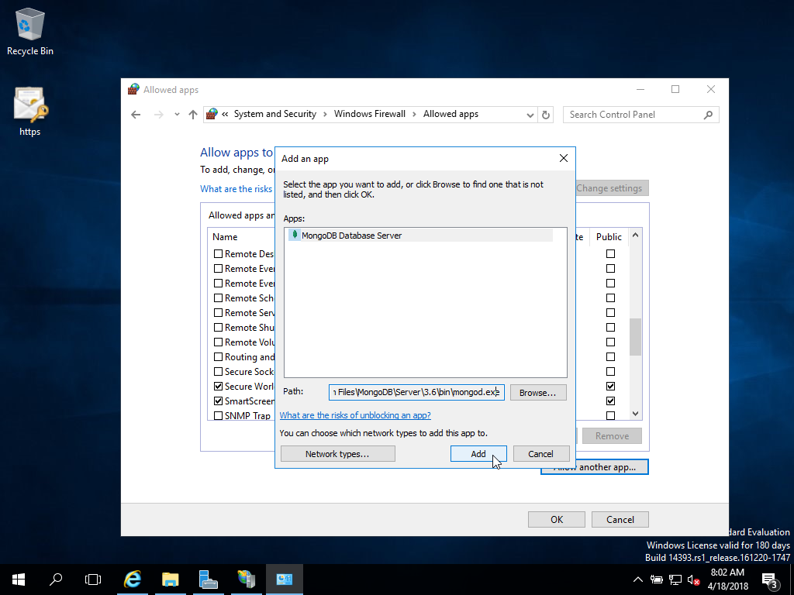


**Настройка службы Windows для MongoDB Community Edition.**

Создайте директорию для базы данных и лог файлов:
Откройте коммандную строку. Нажмите “Win+X”, затем “a”. Выполните:

```
md \data\db
```


и

```
md \data\log
```


команды.


**Создание файла конфигурации.**

Создайте файл “C:\Program Files\MongoDB\Server\3.6\mongod.cfg” в котором описаны переменные systemLog.path и storage.dbPath:

```
systemLog:
    destination: file
    path: c:\data\log\mongod.log
storage:
    dbPath: c:\data\db
```


**Установка службы MongoDB.**

Выполните все команды ниже из командной строки с привилегиями администратора (откройте командную строку. Нажмите “Win+X”, затем “a”).

Выполните:

```
"C:\Program Files\MongoDB\Server\3.6\bin\mongod.exe" --config "C:\Program Files\MongoDB\Server\3.6\mongod.cfg" --install
```


**Запуск службы MongoDB.**

```
net start MongoDB
```


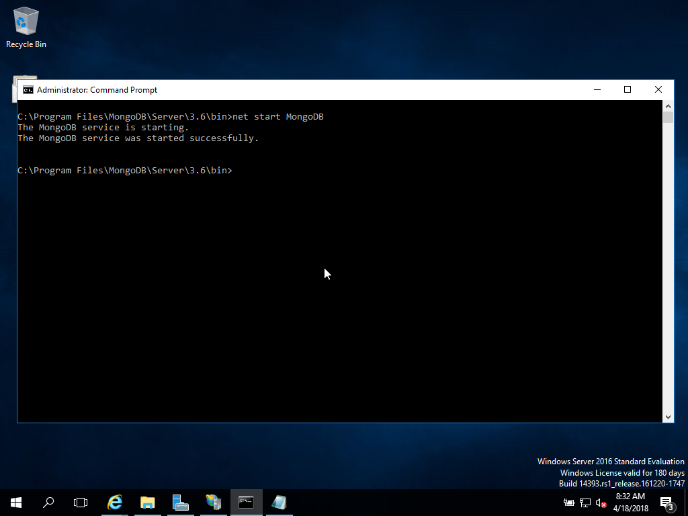


**Убедитесь в том, что служба MongoDB была успешно запущена.**

Проверьте лог файл c:\data\log\mongod.log и обратите внимание на строку: [initandlisten] waiting for connections on port 27017


**3. Установка PHP.**

Мы будем использовать Web Platform Installer для установки PHP, поэтому откройте ссылку [https://www.microsoft.com/web/downloads/platform.aspx](https://www.microsoft.com/web/downloads/platform.aspx) для его установки.

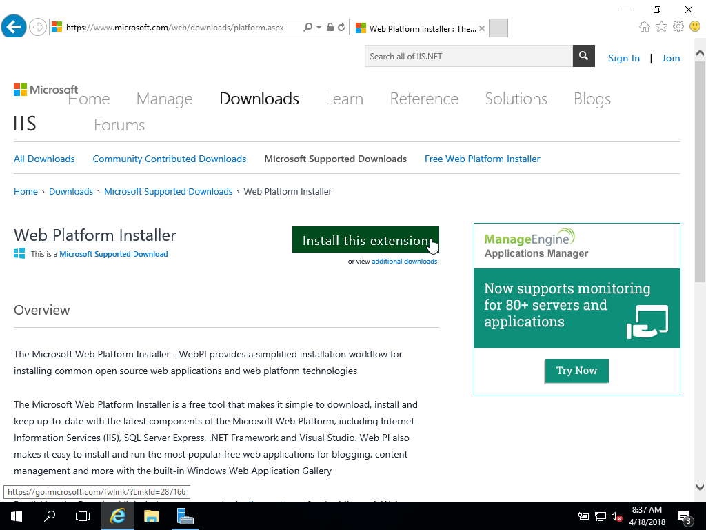

Нажмите “Run”.


Согласитесь с условиями и нажмите “Install”. После завершения установки нажмите “Finish”.


Откройте “Server Manager”, перейдите в “Tools” и кдикните на “Internet Information Services (IIS) Manager”, выберите сервер и дважды кликните на иконке “Web Platform Installer”.

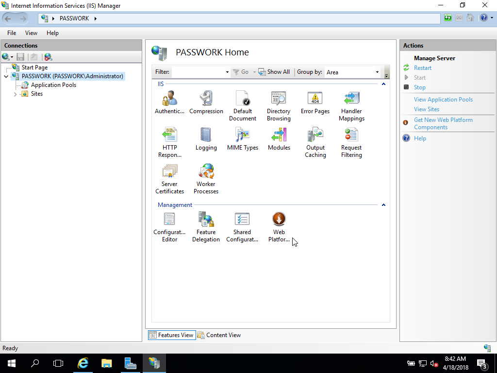

Перейдите на вкладку “Products” и используя поиск найдите доступные версии PHP. Выберите PHP 5.6.31 из списка и нажмите “Add”. Затем выберите “Install” и согласитесь с условиями использования.


Если вы увидите сообщение "PHP Manager for IIS failed to install", то просто проигнорируйте его. Нажмите “Finish”.


**4. Установка Legacy MongoDB PHP драйвера, Phalcon PHP фреймворка, а также дополнительных расширений и опций.**

Перейдите по ссылке [https://windows.php.net/downloads/pecl/releases/mongo/1.5.1/php_mongo-1.5.1-5.6-nts-vc11-x86.zip](https://windows.php.net/downloads/pecl/releases/mongo/1.5.1/php_mongo-1.5.1-5.6-nts-vc11-x86.zip) для скачивания Legacy MongoDB PHP драйвера.

Перейдите по ссылке [https://github.com/phalcon/cphalcon/releases/download/v3.3.2/phalcon_x86_vc11_php5.6.0_3.3.2_nts.zip](https://github.com/phalcon/cphalcon/releases/download/v3.3.2/phalcon_x86_vc11_php5.6.0_3.3.2_nts.zip) для скачивания Phalcon PHP фреймворка.

Распакуйте the “php_mongo-1.5.1-5.6-nts-vc11-x86.zip” архив и скопируйте “php_mongo.dll” в “C:\Program Files (x86)\PHP\v5.6\ext”.

Распакуйте the “phalcon_x86_vc11_php5.6.0_3.3.2_nts.zip” архив и скопируйте “php_phalcon.dll” в “C:\Program Files (x86)\PHP\v5.6\ext”.

Откройте “C:\Program Files (x86)\PHP\v5.6\php.ini” при помощи блокнота и добавьте в раздел [Extension List] следующие строки:

```
extension=php_mongo.dll
extension=php_phalcon.dll
extension=php_ldap.dll
```


Сохраните изменения и закройте блокнот.


**5. Загрузка и установка Passwork.**

Откройте URL репозитория в браузере [http://get.passwork.pro:81/](http://get.passwork.pro:81/) Войдите в систему используя предоставленный логин и пароль.


Выберите репозиторий “passwork”.

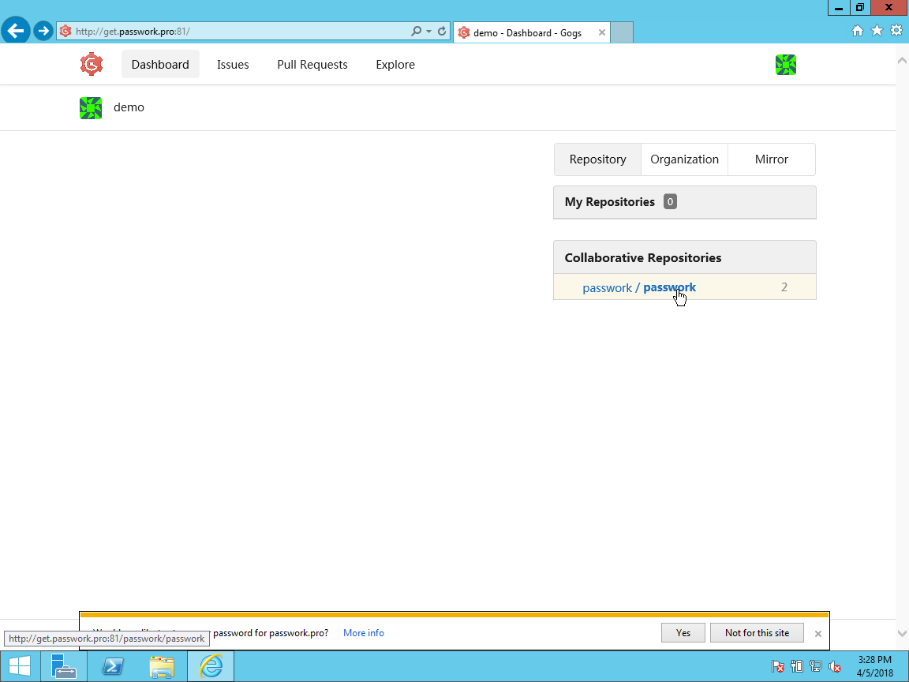

Нажмите на иконку загрузки и выберите ZIP опцию.

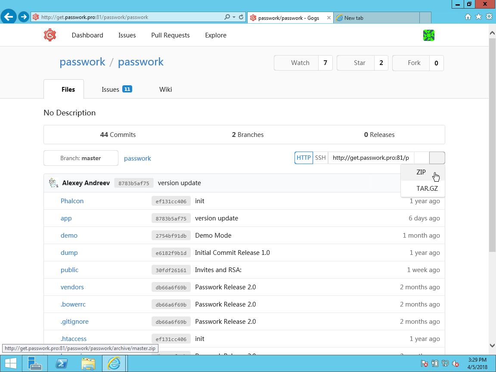

Извлеките архив и скопируйте содержимое папки "paswork" в директорию “C:\inetpub\wwwroot\”.

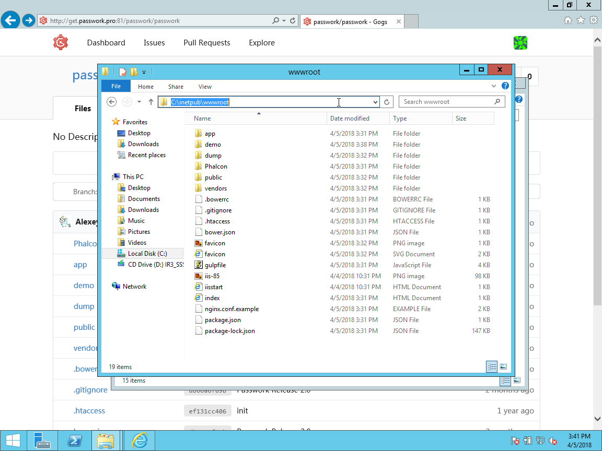


**Создание файла конфигурации.**

Создайте копию файла “C:\inetpub\wwwroot\app\config\config.example.ini” в директории “C:\inetpub\wwwroot\app\config\” и измените его имя на “config.ini”.


**Установка прав доступа.**

Откройте IIS Manager, нажмите правой кнопкой на вебсайт и выберите “Edit permissions”.


Нажмите “Edit”, затем “Add” найдите “IUSR” аккаунт. Выберите в списке “IUSR” и разрешите “Write” опцию, затем нажмите “Ok” два раза.

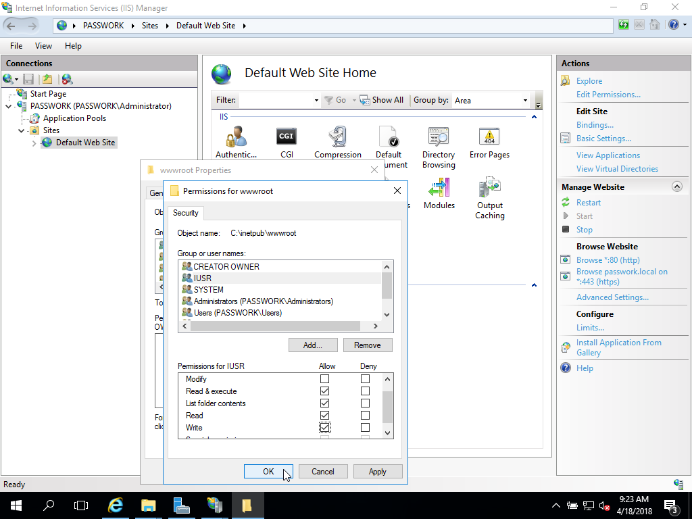


**Изменение физического пути веб-сайта.**

Нажмите правой кнопкой мыши на “Default Web Site” > “Manage Website” > “Advanced Settings”. Измените физическое расположение сайта на “C:\inetpub\wwwroot\public\”, затем нажмите “Ok”.

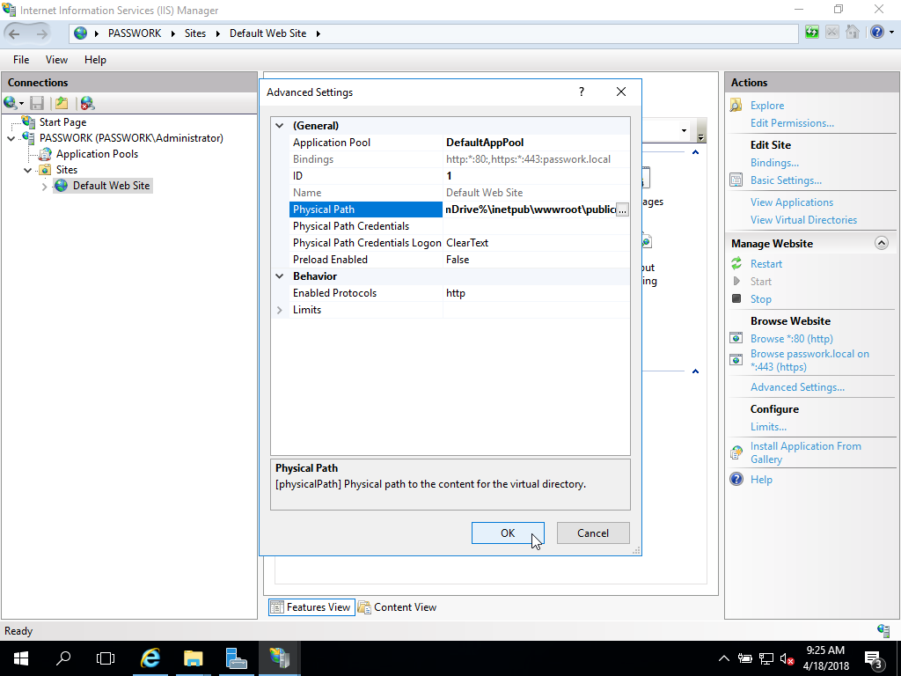


**Восстановление базы данных MongoDB.**

Откройте командную строку. Нажмите “Win+X”, затем “a”.

Выполните следующие команды:

```
cd C:\Program Files\MongoDB\Server\3.6\bin
```
```
mongorestore --db pwbox C:\inetpub\wwwroot\dump\pwbox
```


После выполнения команд будет создана база данных passwork.


**Rewrite rules**

Используя “Web Platform Installer” установите “URL Rewrite” модуль.

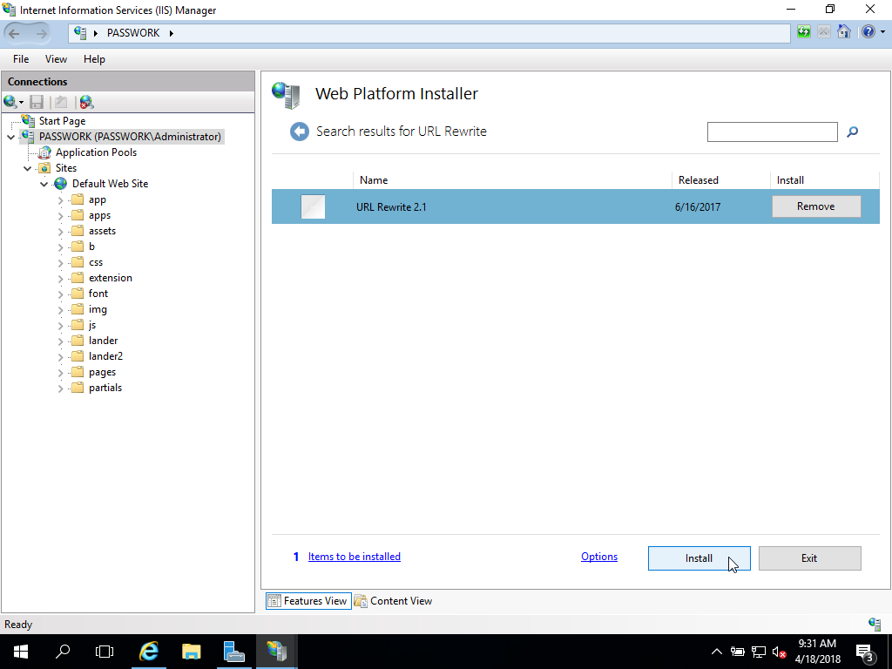

Закройте IIS Manager и снова откройте его, выберите вебсайт. Кликните два раза на иконку “URL Rewrite”. Нажимите “Import rules” и выберите .htaccess файл из корневой директории сайта, нажмите “Open” затем “Import”.

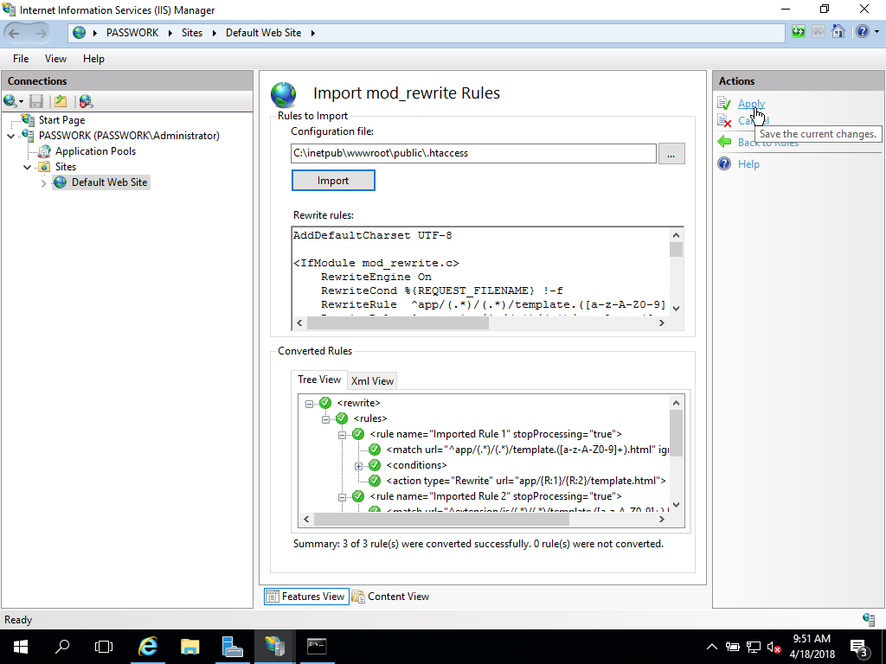

Нажмите “Apply” после успешного импорта.


**Установка лицензии.**

Распакуйте архив с ключами для регистрации и переместите файлы `.lic` и `reginfo.php` в директорию `C:\inetpub\wwwroot\app\config\`.


**Установка завершена.**

Откройте [http://passwork.local](http://passwork.local) для доступа к вебсайту.


**Используйте учетную запись по умолчанию для входа в систему:**

логин: `admin@passwork.me`

пароль: `DemoDemo`


**6. Configure SSL certificate on IIS 10.**

Откройте “Server Manager”, выберите “Tools” затем “Internet Information Services (IIS) Manager”, выберите сервер и два раза кликните на “Server Certificates”, импортируйте сертификат.


Перейдите к сайтам, выберите сайт и нажмите “Bindings”. Выберите “https” протокол из выпадающего списка. Введите полное доменное имя “passwork.local”. Выберите SSL сертификат из списка (в инструкции имя сертификата “https”).


Затем нажмите “Close”.

Проверьте SSL-соединение, откройте ссылку [https://passwork.local](https://passwork.local).


**7. Установка SMTP сервера.**

Откройте “Server Manager” и добавьте роль “SMTP Server”.

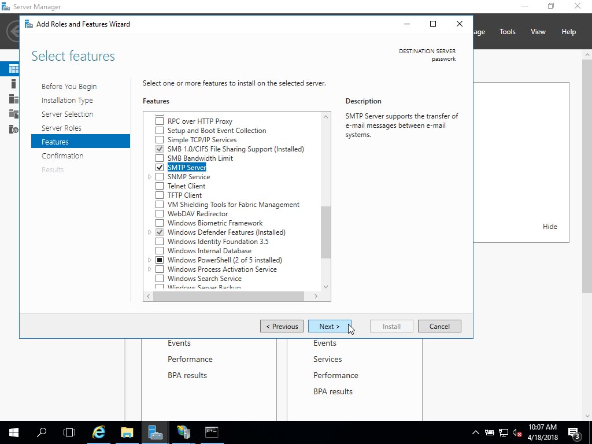

Откройте "IIS 6.0 Manager" и настройте SMTP server.


Откройте вкладку “Delivery”, нажмите на “Advanced” и заполните поле “Smart host”. Для Gmail в этом поле должен быть адрес “smtp.gmail.com”.


Нажмите на “Outbound connections” и задайте исходящий TCP порт - “587”.


Нажмите на “Outbound Security” кнопку, выберите “Basic Authentication” и заполните "user name" и "password" поля. Включите опцию “TLS Encryption”.

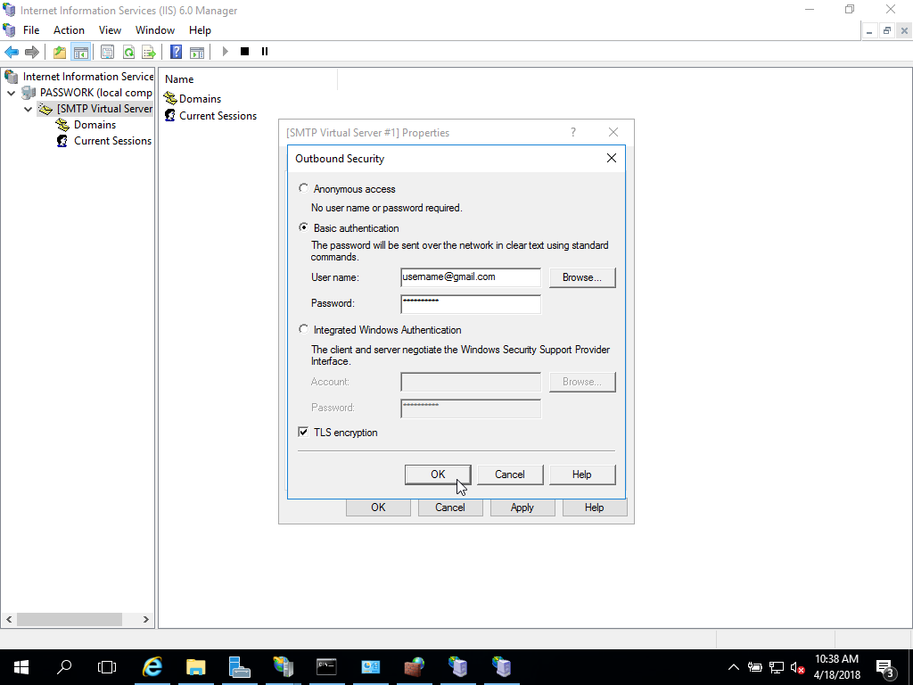

Нажмите на “Access” tab > “Connection” и добавьте ip адрес 127.0.0.1 в список разрешенных.


Нажмите на “Access” tab > “Relay” и добавьте ip адрес 127.0.0.1 в список разрешенных.


**Запуск SMTP-сервера при загрузке системы.**

Откройте командную строку - Нажмите “Win+X”, затем “a”. Выполните следующие команды:

```
powershell
```
```
set-service smtpsvc -StartupType Automatic
```


Настройка SMTP-сервера завершена.
